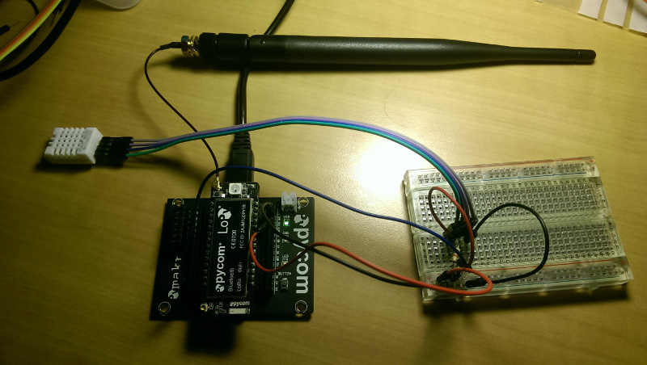

# Broadcast DHT22 temperature/humidity-readings over Dingnet LoRaWAN using LoPy & Micropython

Required stuff:
* Pycom LoPy-board + external antenna
* KU Leuven student/personel-account (registered for Dingnet access)
* DHT22 temperature/humidity sensor
* 4K7 resistor
* Micropython script: [lorasense.py](lorasense.py)

This [Micropython](https://micropython.org/) script, [`lorasense.py`](lorasense.py), demonstrates connecting a [Pycom](https://pycom.io/) LoPy-board to the [KU Leuven LoRaWAN Dingnet-network](https://admin.kuleuven.be/icts/services/dingnet/en). It uses a [DHT22 temperature and humidity sensor](https://www.adafruit.com/product/385) to illustrate broadcasting sensor-readings over LoRaWAN, values that can be read back over [MQTT](http://mqtt.org/).

On the hardware-side, connect the DHT22-sensor to the 3.3V & ground pin of the LoPy-board, and the data-pin to the G28-pin. Use an external 4K7 pull-up resistor on this data-pin. Connect the LoPy-board with USB, giving a virtual serial console on a serial device, e.g. `/dev/ttyUSB0`.

Following [instructions](https://admin.kuleuven.be/icts/services/dingnet/english/howto), create an application and enter an application EUI, application key, and device EUI in the [Dingnet dashboard](https://dingnet-account.icts.kuleuven.be/platform/). You can generate an device EUI via the LoPy-console:

    >>> import network
    >>> import binascii
    >>> binascii.hexlify(network.LoRa().mac())
    b'70b3d5499ecxxxxx'

Get the Micropython [DHT22-library by Erik de Lange](https://github.com/erikdelange/WiPy-2.0-DHT22), and upload it to the LoPy-board [using ampy](https://github.com/adafruit/ampy).

    curl -O https://raw.githubusercontent.com/erikdelange/WiPy-2.0-DHT22/master/dht22.py
    ampy -p /dev/ttyUSB0 put dht22.py

Change the application EUI and key in the Micropython script `lorasense.py`, and upload it to the LoPy-board.

    ampy -p /dev/ttyUSB0 put lorasense.py

Start a terminal session at 115200 baud for the appropriate serial device

    screen -p /dev/ttyUSB0 115200

The terminal session will give you a familiar Python REPL. Import the `monitor()` function for the uploaded `lorasense.py` script, and run it without arguments.

    >>> from lorasense import monitor
    >>> monitor()
    Trying to join LoRa-network
    Joined LoRa-network, start monitoring temperature/humidity
    RH = 36.9%  T = 22.8C
    RH = 36.9%  T = 22.9C
    RH = 36.9%  T = 22.9C
    ...

After a few seconds you should connect to Dingnet, and the script will start polling the DHT22-sensor for temperature and humidity levels. If new values are available (2 second delay), these will be printed to the terminal, and send out over LoRaWAN using a socket. 

You can connect to the Dingnet MQTT server to see the values being broadcasted by the LoPy-device over LoRaWan (connection details in the Dingnet dashboard):

    sudo apt-get install mosquitto mosquitto-clients
    mosquitto_sub -h 'icts-p-dingnet-account-1.lnx.icts.kuleuven.be' -p 1883 -t 'app_u00xxxxxx/#' -d -u u00xxxxxx -P 10bfde7dfffceb74911d5cxxxxxxxxxx

Unfortunately, currently the Dingnet MQTT server is only accessible from inside the KU Leuven-network. If needed, you can connect through VPN first, before running the mosquitto client. The openconnect VPN-client with the ['experimental' Juniper Network Connect protocol](http://www.infradead.org/openconnect/juniper.html) is able to connect.

    sudo apt-get install openconnect
    openconnect -v --juniper https://extranet.kuleuven.be/b

With the running mosquitto client, you get a MQTT-message for each temperature and humidity-value broadcast in the CLI. These are available in the value to the "payload_raw"-key, but encoded in base64. Decoding from base64 gives you a string starting with a 'T' or a 'H' and the measured value, e.g. "SDM2Ljc=" is "H36.7", or 36.7% recorded humidity.
